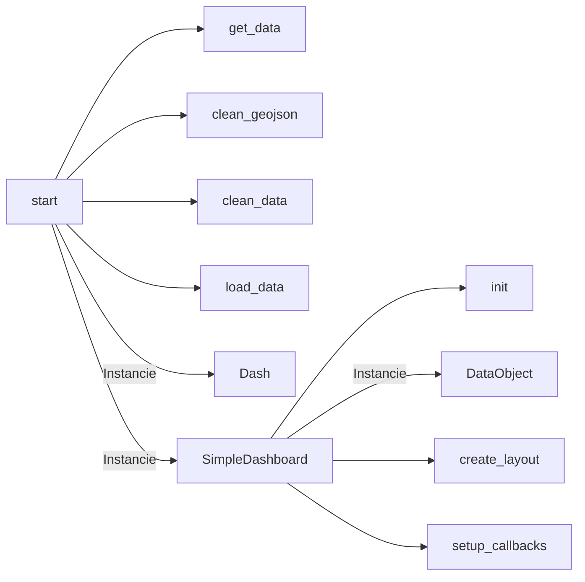
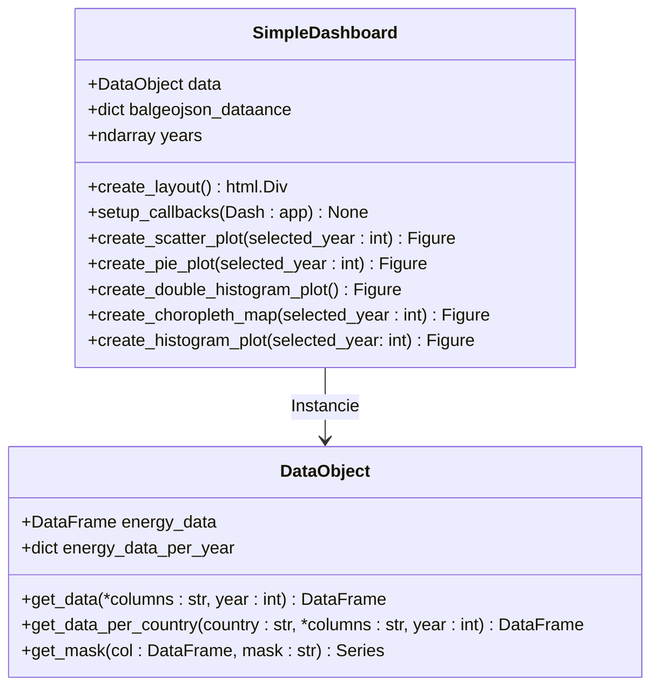

# Table des matières
1. [Présentation du projet](#presentation-du-projet)
2. [User Guide](#user-guide)
3. [Analyse qualité du code](#analyse-qualité-du-code)
4. [Data](#data)
5. [Developer Guide](#developer-guide)
6. [Rapport d'analyse](#rapport-danalyse)
7. [Copyright](#copyright)
8. [Documentations utilisées](#documentations-utilisées)

## Présentation du projet
L'objectif de ce projet est de mettre en pratique les différents éléments vus lors des exercices et des cours pour éclairer un sujet d'intérêt public (météo, environnement...).
Nous avons choisi de parler de l'environnement et plus particulièrement de l'évolution des émissions CO² dans le Monde.

## User Guide
1. Clonez le répertoire Git du projet à l'aide de la commande :
    -     git clone https://github.com/Warcraft94/DataProject-Python
2. À la racine du projet, exécutez la commande ci-dessous pour installer les dépendances :
    -     python -m pip install -r requirements.txt
3. Il faut maintenant configurer l'API Kaggle, pour ce faire vous devez vous créer un compte sur Kaggle et générer un token :
    - Rendez-vous sur [Kaggle](https://www.kaggle.com/) et créez-vous un compte.
    - Ensuite rendez-vous dans votre "*Profil*" > "*Paramètres*" puis cliquez sur le bouton "*Créer un token*" qui va lancer un téléchargement d'un fichier json "*kaggle.json*" contenant votre token.
    - Placez ce fichier "*kaggle.json*" dans le répertoire "*~/.kaggle/kaggle.json*" si vous êtes sous Linux ou bien dans le répertoire  "*C:\Users\<Windows-username>\\.kaggle\kaggle.json*" si vous êtes sous Windows.
<br>

4. Puis exécutez la commande suivante pour lancer l'application :
    -     python main.py
5. Patientez quelques instants, vous devriez avoir un affichage similaire indiquant que le serveur a bien été lancé :

<div align="center">
    
    <p><em>Figure 1 - Résultats dans la console après le lancement du serveur.</em></p>
</div>

## Analyse qualité du code
Lors de la réalisation de notre projet, nous avons utilisé *Radon*, *Ruff*, et *mypy*, trois bibliothèques Python pour analyser la qualité du code selon différents critères.

1. **Radon**
    - [Radon](https://radon.readthedocs.io/en/latest/) est un outil permettant d'évaluer la qualité du code d'un projet en mesurant la complexité et la maintenabilité selon plusieurs critères.
    - Pour lancer l'analyse avec Radon, exécutez la commande ci-dessous :
        -     python -m radon mi .
        - Avec comme options : "*cc*" pour la complexité, "*mi*" pour la maintenabilité et "*raw*" pour les mesures brutes.
<div align="center">
    
    <p><em>Figure 2 - Résultats de la maintenabilité du code avec Radon.</em></p>
</div>

<br>

2. **Ruff**
    - [Ruff](https://docs.astral.sh/ruff//) est un linter et formateur de code Python très rapide, conçu pour détecter les erreurs de style et autres mauvaises pratiques.
    - Pour lancer l'analyse avec Ruff, exécutez la commande ci-dessous :
        -     python -m ruff check .
<div align="center">
    
    <p><em>Figure 3 - Résultats du test de style et mauvaises pratiques après amélioration du code.</em></p>
</div>

<br>

3. **mypy**
    - [mypy](https://mypy.readthedocs.io/en/stable/) est un outil de vérification statique visant à assurer la cohérence des annotations de typage présentes dans le code.
    - Pour lancer l'analyse avec mypy, exécutez la commande ci-dessous :
        -     python -m mypy .
<div align="center">
    
    <p><em>Figure 4 - Résultats du test pour les annotations de typage après amélioration du code.</em></p>
</div>

## Data
1. **Source des données CSV**
    - Nos données statistiques proviennent de [Kaggle](https://www.kaggle.com/), elles sont elles-mêmes issues de l'Agence d'information sur l'énergie ([EIA](https://www.eia.gov/)) et sont disponibles [ici](https://www.kaggle.com/datasets/lobosi/c02-emission-by-countrys-grouth-and-population/data).

    - Colonnes du fichier csv utilisées :
        - **Pays** - *Pays de la donnée.*
        - **Type d'énergie** - *Type d'énergie de la donnée.*
        - **Année** - *Année de la donnée.*
        - **Consommation d'énergie** - *La consommation d'énergie pour le type d'énergie spécifique, mesurée en quad Btu.*
        - **Population** - *La population dy pays concerné, mesurée en Mpersonne.*
        - **Emission de CO2** - *L'émission de CO2 de la donnée, mesurée en MMtonnes CO2.*
*Les données recouvrent une période allant de **1980** à **2019**.*

2. **Source des données GEOJSON**
    - Les données géographiques utilisées pour tracer la carte choroplèthe proviennent de ce dépôt [Github](https://github.com/johan/world.geo.json/blob/master/countries.geo.json).

3. **Pré-traitement des données**
    - Pour les données CSV, nous avons nettoyé et transformé les données brutes récupérées afin de réduire leur complexité et de simplifier les traitements effectués durant le fonctionnement de l'application web.
        - Suppression des colonnes inutilisées dans le projet.
        - Suppression des lignes contenant une ou plusieurs valeurs vides.
        - Traduction des types d'énergies en français.
    - Concernant les données GeoJSON, nous avons simplement réalisé un mappage pour harmoniser certains noms de pays avec ceux utilisés dans le fichier CSV.

## Developer Guide

1. **Structure du projet**
```
DataProject-Python/
├── assets/
├── data/
├── images/
├── src/
│   └── components/
│       ├── __init__.py
│       ├── footer.py
│       └── header.py
│   └── pages/
│       ├── __init__.py
│       └── SimpleDashboard.py
│   └── utils/
│       ├── __init__.py
│       ├── clean_data.py
│       ├── common_functions.py
│       ├── DataObject.py
│       └── get_data.py
├── .gitignore
├── config.py
├── main.py
├── mypy.ini
├── README.md
└── requirements.txt
```
<br>

2. **Architecture du code**


<em>Figure 5 - Déroulement du programme principal.</em>

<br>



<em>Figure 6 - Relation entre les deux classes python créées.</em>
<br>
<br>

3. **Comment ajouter un graphique ?**

    - Pour ajouter un nouveau graphique, il faut :
        - Dans un premier temps, créer une fonction dans SimpleDashboard qui créer un graphique, le configure et renvoit l'objet Figure.
        - Ensuite, se déplacer dans la fonction create_layout de la classe SimpleDashboard et ajouter un nouveau Tab à l'instar des lignes précédentes dans la *figure 7* et mettre en paramètre ```tabn+1``` par rapport au précédent.
        - Enfin, il faut se déplacer dans la fonction setup_callbacks de la classe SimpleDashboard et ajouter une condition pour le nouveau ```tabn+1``` ajouté en recopiant les conditions dans la *figure 8*.

        
        <em>Figure 7 - create_layout dans SimpleDashboard.</em>
        <br>
        <br>
        
        <em>Figure 8 - setup_callbacks dans SimpleDashboard.</em>

## Rapport d'analyse

L'objectif de notre projet est de montrer l'évolution des émissions de CO2 à travers le monde de 1980 au plus proche d'aujourd'hui, pour notre cas, jusqu'en 2019 et pourquoi ? : C'est à dire Pourquoi y a-t-il une évolution de l'émission de CO2 dans le Monde ? Quels pays ont les taux les plus importants ? Quel type d'énergie est la plus impliquée ? ..

Pour ce faire, nous avons regrouper les données sous forme de différents graphiques permettant d'analyser les différentes données et de voir les corrélations.

Dans un premier temps, nous avons développé une carte choroplèthe permettant de voir les pays émettants le plus de CO2 ainsi que leur population totale.


<em>Figure 9 - Carte choroplèthe.</em>

Celle-ci nous a permis d'observer que certains des pays les plus peuplés étaient aussi ceux qui émettaient le plus de CO2 en 2019, ici la Chine et les Etats Unis.

Mais elle nous a aussi permis d'observer le cas contraire avec l'Inde qui est plus peuplé que les Etats Unis mais émet deux fois moins de CO2.

<br>

Pour préciser l'idée d'une corrélation entre la population et les émissions de CO2, nous avons développé un histogramme double permettant de comparer l'évolution de la population à l'évolution de l'émission de CO2 au fil des années.


<em>Figure 10 - Double histogramme.</em>

Cet histogramme nous a permis de voir qu'il semble y avoir une certaine corrélation entre l'évolution de la population et les émissions de CO2, mais que ce n'est pas le seul facteur responsable de l'évolution du taux de CO2 émis.

<br>

Nous nous sommes alors penché sur le rapport entre l'énergie consommée par pays et le taux d'émissions de CO2 émis par ces mêmes pays.

Nous avons développé un graphique en nuage de points représentant donc les pays situés par rapport à leur consommation d'énergie et leur taux d'émissions de CO2.


<em>Figure 11 - Nuage de points.</em>

Ce graphique en nuage de points nous a bien révélé une corrélation entre l'émission de CO2 et la consommation d'énergie en 2019, dessinant presque une diagonale pour cette relation.

<br>

Après avoir déterminé que le taux d'émissions de CO2 était corrélé à la consommation d'énergie ainsi qu'en partie à l'évolution de la population, nous avons cherché à savoir quelle énergie était responsable du plus grand taux d'émission de CO2. 

Nous avons réalisé un graphique circulaire affichant chaque type d'énergie ainsi que leur taux d'émission de CO2 pour le Monde.


<em>Figure 12 - Graphique circulaire.</em>

Celui-ci nous a montré que l'énergie responsable du plus grand taux d'émissions dans le Monde en 2019 était le charbon.

<br>

Pour finir notre analyse, nous avons réalisé un histogramme permettant d'observer le nombre de pays par intervalles de taux d'émissions de CO2 afin de voir la distribution des pays selon leur niveau d'émissions et identifier les intervalles où la majorité des pays se trouvent pour avoir ainsi une vue d'ensemble des tendances globales en des taux d'émissions de CO2.


<em>Figure 13 - Histogramme.</em>

### Conclusion 

La conclusion sur notre analyse est donc que l'évolution de taux d'émissions de CO2 par pays est corrélé avec la consommation d'énergie de chaque pays ainsi que l'évolution de leur population.

## Copyright
Nous déclarons sur l’honneur que le code fourni a été produit par nous même.

## Documentations utilisées
- Dash :    https://dash.plotly.com/ 
- Plotly :  https://plotly.com/python/figure-labels/ 
