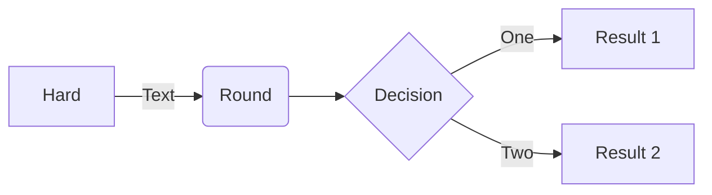

# Table of Contents
1. [Example](#example)

# User Guide
1. Clonez le répertoire Git du projet à l'aide de la commande suivante :
-     git clone https://github.com/Warcraft94/DataProject-Python
2. À là racine du projet, faite la commande suivante pour installer les dépendances :
-     python -m pip install -r requirements.txt
3. Pour configurer l'API Kaggle, vous devez tout d'abord vous crée un compte sur Kaggle et crée un token. Pour cela :
- Rendez-vous sur [Kaggle](https://www.kaggle.com/) et créer vous un compte.
- Ensuite rendez-vous dans votre Profil puis dans Paramètres.
- Ici, vous devez cliquer sur "Créer un token" et puis placer le fichier "kaggle.json" contenant votre token dans le répertoire "~/.kaggle/kaggle.json" sous Linux, et dans "C:\Users\<Windows-username>\.kaggle\kaggle.json" pour Windows.
- Puis exécuter la commande :
-     python -m pip install -r requirements.txt
4. Puis exécuter la commande suivant pour lancer l'application :
-     python main.py
5. Patientez quelques instants puis vous devriez avoir un affichage similaire indiquant que le serveur a bien été lancé :
- TODO:image

# Data
1. Nos données principalement utilisées proviennent de [Kaggle](https://www.kaggle.com/), provenant par defaut de l'Agence d'information sur l'énergie ([EIA](https://www.eia.gov/)) :
   - *https://www.kaggle.com/datasets/lobosi/c02-emission-by-countrys-grouth-and-population/data*
     
    **Colonnes utilisées après un trie :**
    - **Pays** - *Pays de la donnée.*
    - **Type d'énergie** - *Type d'énergie de la donnée.*
    - **Année** - *Année de la donnée.*
    - **Consommation d'énergie** - *La consommation d'énergie pour le type d'énergie spécifique, mesurée en quad Btu.*
    - **Population** - *La population dy pays concerné, mesurée en Mpersonne.*
    - **Emission de CO2** - *L'émission de CO2 de la donnée, mesurée en MMtonnes CO2.*

2. Les données geojson qui nous permettant de dessiné la carte choroplèthe proviennent de ce dépôt Github :
   - *https://github.com/johan/world.geo.json/blob/master/countries.geo.json*

# Developer Guide

# Rapport d'analyse

Temporaire

# Copyright
Nous déclarons sur l’honneur que le code fourni a été produit par nous même.

# Documentations utilisées
- Dash : https://dash.plotly.com/ 
- Plotly : https://plotly.com/python/figure-labels/ 
