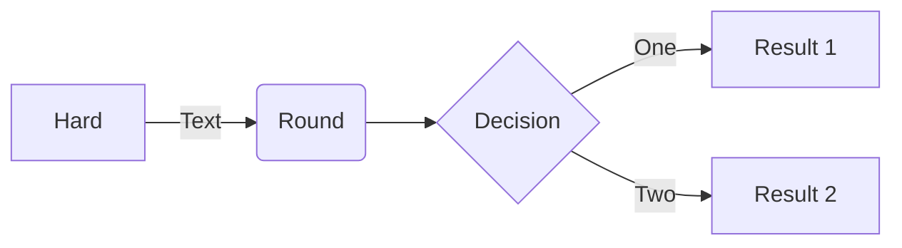

# Table of Contents
1. [Présentation du projet](#presentation-du-projet)
2. [User Guide](#user-guide)
3. [Analyse qualité du code](#analyse-qualité-du-code)
3. [Data](#data)
4. [Developer Guide](#developer-guide)
5. [Rapport d'analyse](#rapport-danalyse)
6. [Documentations utilisées](#documentations-utilisées)

## Présentation du projet
L'objectif de ce projet était de mettre en pratique les différents éléments vus lors des exercices et des cours pour éclairer un sujet d'intérêt public (météo, environnement...).
Nous avons donc choisi de parler de l'environnement et plus particulièrement des émissions CO².

## User Guide
## Lancement du projet
1. Clonez le répertoire Git du projet à l'aide de la commande suivante :
    -     git clone https://github.com/Warcraft94/DataProject-Python
2. À la racine du projet, faites la commande suivante pour installer les dépendances :
    -     python -m pip install -r requirements.txt
3. Ensuite pour configurer l'API Kaggle, vous devez tout d'abord vous crée un compte sur Kaggle et crée un token :
    - Rendez-vous sur [Kaggle](https://www.kaggle.com/) et créez-vous un compte.
    - Ensuite rendez-vous dans votre "*Profil*" > "*Paramètres*" puis cliquez sur le bouton "*Créer un token*" qui vous téléchargera un fichier "*kaggle.json*" contenant votre token.
    - Avec ce fichier "*kaggle.json*" placer le dans le répertoire "*~/.kaggle/kaggle.json*" sous Linux ou bien dans le répertoire  "*C:\Users\<Windows-username>\\.kaggle\kaggle.json*" sous Windows.
 
4. Puis exécuter la commande suivante pour lancer l'application :
    -     python main.py
5. Patientez quelques instants puis vous devriez avoir un affichage similaire indiquant que le serveur a bien été lancé :
    
    *Figure 1 - Résultats dans la console après le lancement du serveur.*

## Analyse qualité du code
radon
ruff
mypi

## Data
1. **Source des données CSV**
    - Nos données principales proviennent de [Kaggle](https://www.kaggle.com/), elles-mêmes issues de l'Agence d'information sur l'énergie ([EIA](https://www.eia.gov/)) et sont disponible [ici](https://www.kaggle.com/datasets/lobosi/c02-emission-by-countrys-grouth-and-population/data).

    - Colonnes utilisées après un nettoyage :
        - **Pays** - *Pays de la donnée.*
        - **Type d'énergie** - *Type d'énergie de la donnée.*
        - **Année** - *Année de la donnée.*
        - **Consommation d'énergie** - *La consommation d'énergie pour le type d'énergie spécifique, mesurée en quad Btu.*
        - **Population** - *La population dy pays concerné, mesurée en Mpersonne.*
        - **Emission de CO2** - *L'émission de CO2 de la donnée, mesurée en MMtonnes CO2.*
*Les données recouvrent une période allant de **1980** à **2019**.*

2. **Source des données Géographique**
    - Les données geojson utilisées pour tracer la carte choroplèthe proviennent de ce dépôt [Github](https://github.com/johan/world.geo.json/blob/master/countries.geo.json).

3. 

## Developer Guide
Temporaire

## Rapport d'analyse

## Copyright
Nous déclarons sur l’honneur que le code fourni a été produit par nous même.

## Documentations utilisées
- Dash : https://dash.plotly.com/ 
- Plotly : https://plotly.com/python/figure-labels/ 
