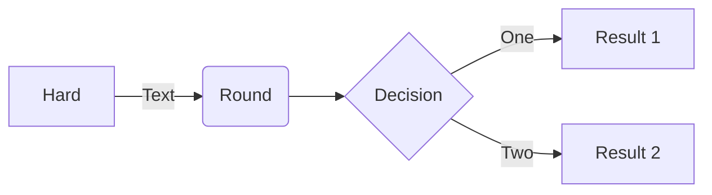
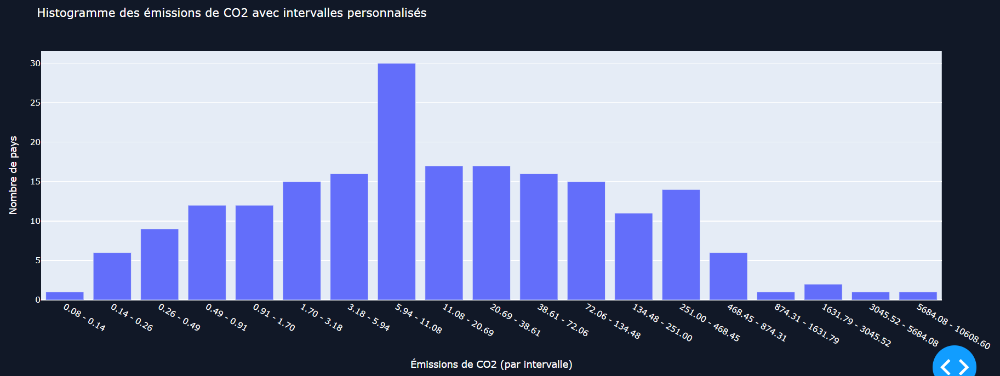
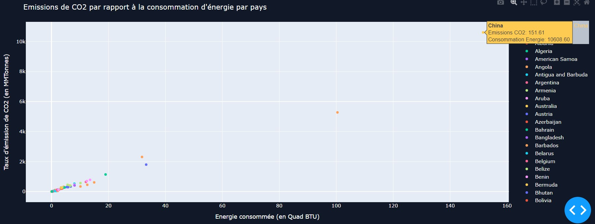
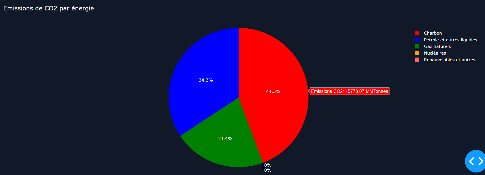
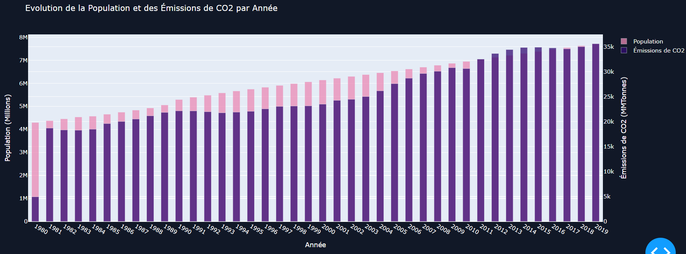

# Table of Contents
1. [Présentation du projet](#presentation-du-projet)
2. [User Guide](#user-guide)
3. [Analyse qualité du code](#analyse-qualité-du-code)
3. [Data](#data)
4. [Developer Guide](#developer-guide)
5. [Rapport d'analyse](#rapport-danalyse)
6. [Documentations utilisées](#documentations-utilisées)

## Présentation du projet
L'objectif de ce projet était de mettre en pratique les différents éléments vus lors des exercices et des cours pour éclairer un sujet d'intérêt public (météo, environnement...).
Nous avons donc choisi de parler de l'environnement et plus particulièrement des émissions CO².

## User Guide
## Lancement du projet
1. Clonez le répertoire Git du projet à l'aide de la commande suivante :
    -     git clone https://github.com/Warcraft94/DataProject-Python
2. À la racine du projet, faites la commande suivante pour installer les dépendances :
    -     python -m pip install -r requirements.txt
3. Ensuite pour configurer l'API Kaggle, vous devez tout d'abord vous crée un compte sur Kaggle et crée un token :
    - Rendez-vous sur [Kaggle](https://www.kaggle.com/) et créez-vous un compte.
    - Ensuite rendez-vous dans votre "*Profil*" > "*Paramètres*" puis cliquez sur le bouton "*Créer un token*" qui vous téléchargera un fichier "*kaggle.json*" contenant votre token.
    - Avec ce fichier "*kaggle.json*" placer le dans le répertoire "*~/.kaggle/kaggle.json*" sous Linux ou bien dans le répertoire  "*C:\Users\<Windows-username>\\.kaggle\kaggle.json*" sous Windows.
 
4. Puis exécuter la commande suivante pour lancer l'application :
    -     python main.py
5. Patientez quelques instants puis vous devriez avoir un affichage similaire indiquant que le serveur a bien été lancé :
    
    *Figure 1 - Résultats dans la console après le lancement du serveur.*

## Analyse qualité du code
radon
ruff
mypi

## Data
1. **Source des données CSV**
    - Nos données principales proviennent de [Kaggle](https://www.kaggle.com/), elles-mêmes issues de l'Agence d'information sur l'énergie ([EIA](https://www.eia.gov/)) et sont disponible [ici](https://www.kaggle.com/datasets/lobosi/c02-emission-by-countrys-grouth-and-population/data).

    - Colonnes utilisées après un nettoyage :
        - **Pays** - *Pays de la donnée.*
        - **Type d'énergie** - *Type d'énergie de la donnée.*
        - **Année** - *Année de la donnée.*
        - **Consommation d'énergie** - *La consommation d'énergie pour le type d'énergie spécifique, mesurée en quad Btu.*
        - **Population** - *La population dy pays concerné, mesurée en Mpersonne.*
        - **Emission de CO2** - *L'émission de CO2 de la donnée, mesurée en MMtonnes CO2.*
*Les données recouvrent une période allant de **1980** à **2019**.*

2. **Source des données Géographique**
    - Les données geojson utilisées pour tracer la carte choroplèthe proviennent de ce dépôt [Github](https://github.com/johan/world.geo.json/blob/master/countries.geo.json).

3. 

## Developer Guide
Temporaire

## Rapport d'analyse

L'objectif de notre projet est de montrer l'évolution des émissions de CO2 à travers le monde de 1980 au plus 
proche d'aujourd'hui, pour notre cas, jusqu'en 2019 et pourquoi ? : C'est à dire Pourquoi y a-t-il une évolution 
de l'émission de CO2 dans le Monde ? Quels pays ont les taux les plus importants ? Quel type d'énergie est la 
plus impliquée ? ..

Pour ce faire, nous avons regrouper les données sous forme de différents graphiques permettant d'analyser les 
différentes données et de voir les corrélations.

Dans un premier temps, nous avons développé une carte choroplèthe permettant de voir les pays émettants le plus 
de CO2 ainsi que leur population totale.

Celle-ci nous a permis d'observer que certains des pays les plus peuplés étaient aussi ceux qui émettaient le 
plus de CO2 en 2019, ici la Chine et les Etats Unis.

Mais elle nous a aussi permis d'observer le cas contraire avec l'Inde qui est plus peuplé que les Etats Unis 
mais émet deux fois moins de CO2.

Pour préciser l'idée d'une corrélation entre la population et les émissions de CO2, nous avons développé un 
histogramme double permettant de comparer l'évolution de la population à l'évolution de l'émission de CO2 au fil des 
années.

Cet histogramme nous a permis de voir qu'il semble y avoir une certaine corrélation entre l'évolution de la 
population et les émissions de CO2, mais que ce n'est pas le seul facteur responsable de l'évolution du taux de 
CO2 émis.

Nous nous sommes alors penché sur le rapport entre l'énergie consommée par pays et le taux d'émissions de CO2 
émis par ces mêmes pays.

Nous avons développé un graphique en nuage de points représentant donc les pays situés par rapport à leur 
consommation d'énergie et leur taux d'émissions de CO2.

Ce graphique en nuage de points nous a bien révélé une corrélation entre l'émission de CO2 et la consommation 
d'énergie en 2019, dessinant presque une diagonale pour cette relation.

Après avoir déterminé que le taux d'émissions de CO2 était corrélé à la consommation d'énergie ainsi qu'en 
partie à l'évolution de la population, nous avons cherché à savoir quelle énergie était responsable du plus 
grand taux d'émission de CO2. 

Nous avons réalisé un graphique circulaire affichant chaque type d'énergie ainsi que leur taux d'émission de CO2 
pour le Monde.

Celui-ci nous a montré que l'énergie responsable du plus grand taux d'émissions dans le Monde en 2019 était le 
charbon.

Pour finir notre analyse, nous avons réalisé un histogramme permettant d'observer le nombre de pays par 
intervalles de taux d'émissions de CO2 afin de voir la distribution des pays selon leur niveau d'émissions et 
identifier les intervalles où la majorité des pays se trouvent pour avoir ainsi une vue d'ensemble des tendances 
globales en des taux d'émissions de CO2.

### Conclusion 

La conclusion sur notre analyse est donc que l'évolution de taux d'émissions de CO2 par pays est corrélé avec la 
consommation d'énergie de chaque pays ainsi que l'évolution de leur population.

## Copyright
Nous déclarons sur l’honneur que le code fourni a été produit par nous même.

## Documentations utilisées
- Dash : https://dash.plotly.com/ 
- Plotly : https://plotly.com/python/figure-labels/ 
